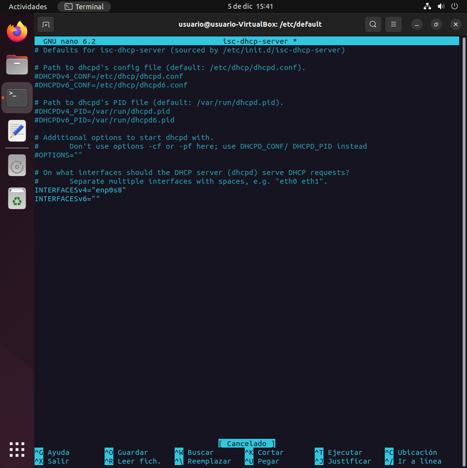

# Práctica DHCP en Máquina Virtual

## 1.Instalación del servidor dchp

## 2.Configuración del servidor

## 3.Configuración de la interfaz de red

En este caso el intefaz *enp0s8* es la interfaz de red interna del servidor

## 4.Asingación de la dirección IP al interfaz

## 5.Arranque y comprobación del estado del servidor

## 6.Comprobación en el cliente

## 7.Configuración de asignación de una IP fija

## 8.Comprobación en el cliente

## 9.Captura de paquetes en Wireshark

